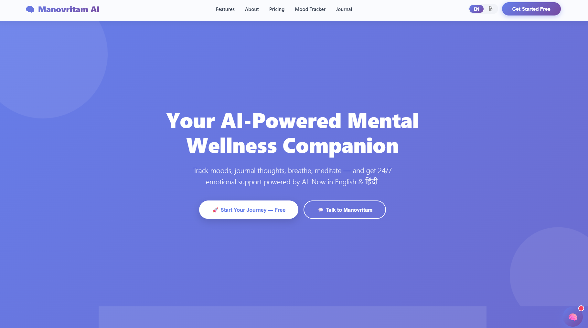
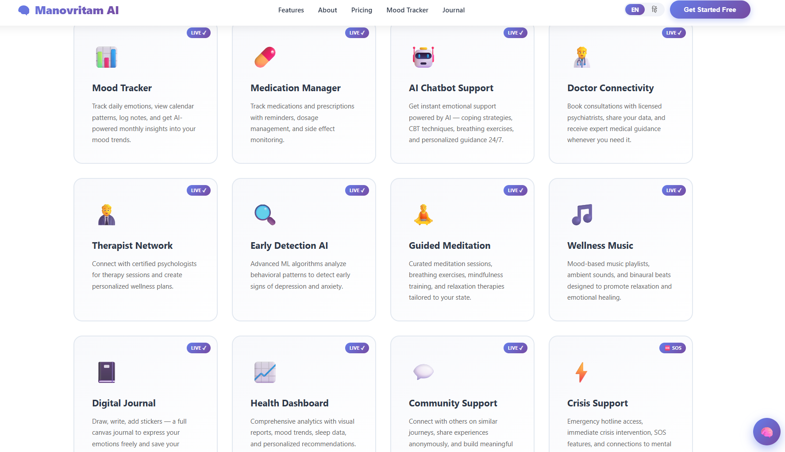
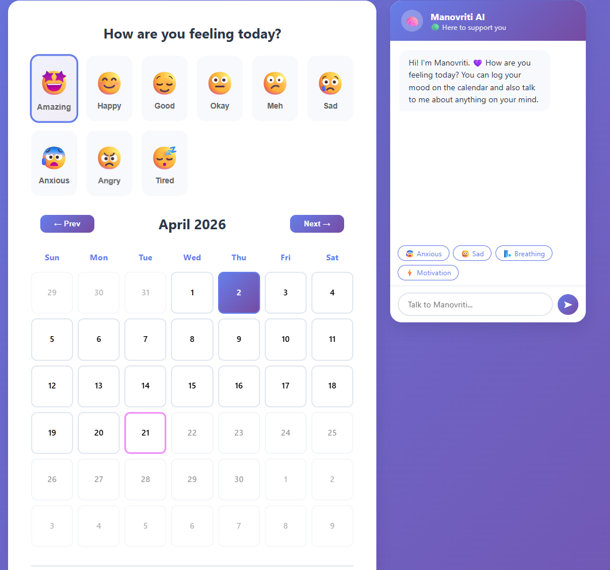
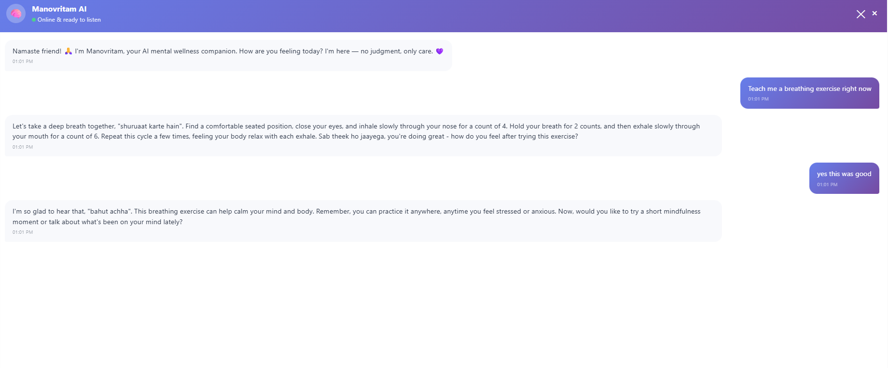
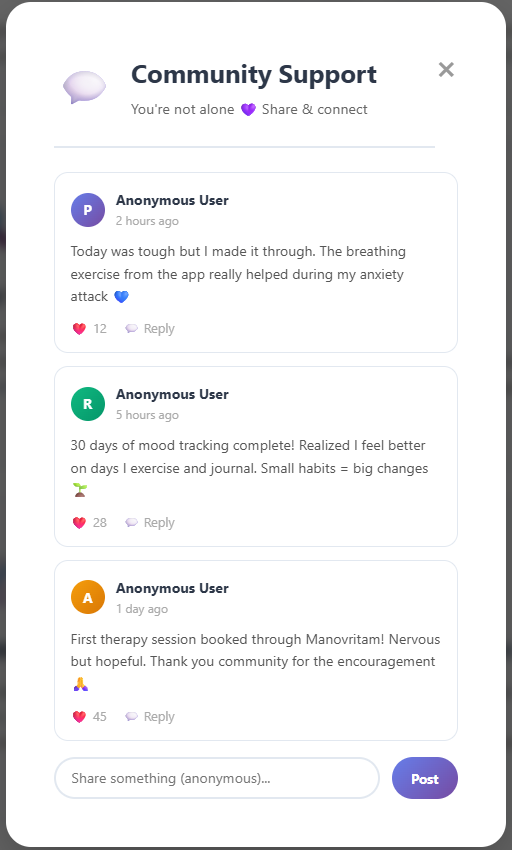
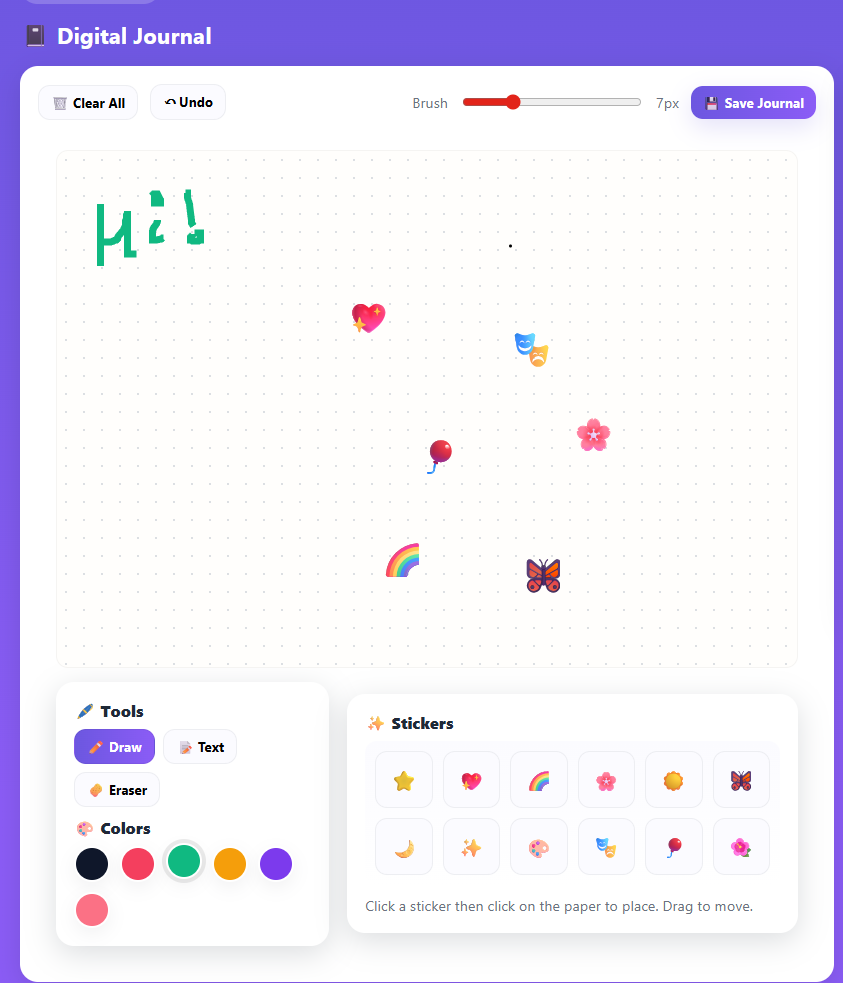
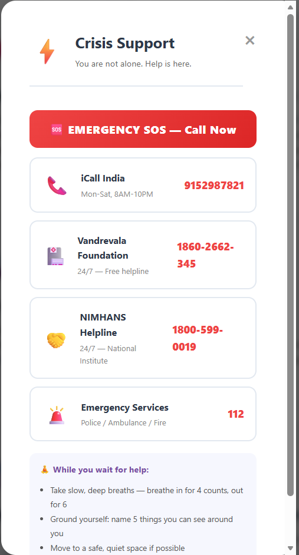
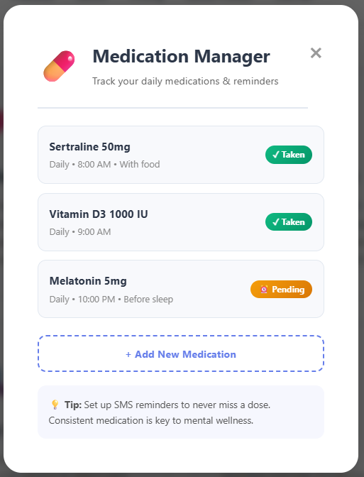

<div align="center">

# 🧠 Manovriti AI v2

### *Mental Health & Wellness Platform*

> 🤖 AI-Powered Mental Health Support &nbsp;|&nbsp; 🌐 Hindi + English &nbsp;|&nbsp; 💜 Your Wellness Companion

<br/>

<p align="center">
  
  
  
  
  
</p>

<p align="center">
  
  
  
</p>

</div>

---

<div align="center">

## 💜 About Manovriti AI

</div>

> **Manovriti AI** is a full-featured **Mental Health & Wellness Platform** powered by **Google Gemini AI**. Designed with empathy and intelligence, it provides users with an AI companion for emotional support, mood tracking, guided meditation, and mental wellness — all in **Hindi & English**.

<br/>

---

## ✨ What's New in v2

<div align="center">

| 🆕 Feature | 📝 Description |
|:---:|:---|
| 🔐 **Google Sign-In** | One-click login with Google account |
| 🌐 **Bilingual Support** | Full Hindi + English toggle (EN/हिं) everywhere |
| 🤖 **Bigger Chatbot** | Enhanced 440×640px AI chatbot with language bar |
| 🕐 **Timestamps** | Every message now shows time |
| 📓 **Gratitude Journal** | New journaling routes added |
| 🌬️ **Breath Stats** | Breathing exercise statistics |

</div>

---

## 🖥️ Screenshots

<div align="center">

### 🏠 Home Page


<br/><br/>

### 📊 Dashboard & Mood Tracker
<p>
  
  &nbsp;
  
</p>

<br/>

### 💬 AI Chat & Community
<p>
  
  &nbsp;
  
</p>

<br/>

### 📓 Journal & Crisis Support
<p>
  
  &nbsp;
  
</p>

<br/>

### 💊 Medication Manager


</div>

---

## 🌐 Features

<div align="center">

```
╔══════════════════════════════════════════════════════════════╗
║              🧠 MANOVRITI AI — FEATURE MAP                   ║
╠══════════════════════════════════════════════════════════════╣
║  🤖 AI Chatbot (EN+Hindi)    →  All Pages                    ║
║  📊 Mood Tracker + Insights  →  mood-tracker.html            ║
║  💊 Medication Manager       →  medication-manager.html      ║
║  🧘 Guided Meditation        →  meditation.html              ║
║  👨‍⚕️ Doctor Connectivity      →  doctor.html                  ║
║  📓 Digital Canvas Journal   →  journal.html                 ║
║  🆘 Crisis Support           →  crisis.html                  ║
║  👥 Community Forum          →  community.html               ║
╚══════════════════════════════════════════════════════════════╝
```

</div>

---

## ⚡ Quick Setup (5 Steps)

### Step 1 — 🔑 Get Gemini API Key (FREE)

```bash
1. Go to → https://aistudio.google.com/app/apikey
2. Sign in with Google
3. Click "Create API Key" → Copy it ✅
```

### Step 2 — 🔐 Get Google OAuth Client ID

```bash
1. Go to → https://console.cloud.google.com
2. Create a project (or select existing)
3. APIs & Services → Credentials
4. "+ CREATE CREDENTIALS" → OAuth 2.0 Client ID
5. Application type: Web application
6. Authorized JavaScript origins: http://localhost:5000
7. Click Create → Copy the Client ID ✅
```

> 💡 **Google Sign-In is OPTIONAL** — Email signup works without it!

### Step 3 — 📦 Install Dependencies

```bash
cd backend
npm install
```

### Step 4 — ⚙️ Create .env File

```bash
# Windows:
copy .env.example .env

# Mac/Linux:
cp .env.example .env
```

Open `.env` and fill in:

```env
GEMINI_API_KEY=AIzaSyXXXXXXXXXXXXXXXXXXXXXXX
GOOGLE_CLIENT_ID=123456789-xxxxx.apps.googleusercontent.com
PORT=5000
```

### Step 5 — 🚀 Start Server

```bash
node server.js
```

Open **http://localhost:5000** — you'll see:

```
🧠 Manovriti AI v2 → http://localhost:5000
🔑 Gemini Key:   ✅ Set
🔑 Google OAuth: ✅ Set
```

---

## 🛠️ Tech Stack

<div align="center">

<p>
  
  
  
  
  
  
  
</p>

</div>

---

## 🔑 Google Sign-In Notes

- ✅ Works only when `GOOGLE_CLIENT_ID` is set in `.env`
- ✅ The server exposes the client ID to the frontend automatically
- ✅ Without it, email signup/login still works perfectly
- ⚠️ Users who sign up with Google **cannot** login with email (and vice versa)

---

## 🗂️ Project Structure

```
Manovritam-AI/
│
├── 📁 backend/
│   ├── server.js          # Main entry point
│   ├── .env.example       # Environment variables template
│   ├── package.json
│   └── ...
│
├── 📁 screenshots/        # App screenshots
│   ├── home.png
│   ├── dashboard.png
│   ├── chat.png
│   ├── mood.png
│   ├── journal.png
│   ├── crisis.png
│   ├── community.png
│   └── medication.png
│
└── README.md
```

---

## 🤝 Contributing

Contributions are welcome! Feel free to:

- 🐛 Report bugs
- 💡 Suggest features
- 🔧 Submit pull requests

---

## 📄 License

This project is licensed under the **MIT License**.

---

<div align="center">

---

**Made with 💜 by [Ansh Mittal](https://github.com/anshmittal2004)**

*4th Year Major Project — Mental Health & Wellness Platform*

<br/>

⭐ **Star this repo if you found it helpful!** ⭐

<br/>


</div>
